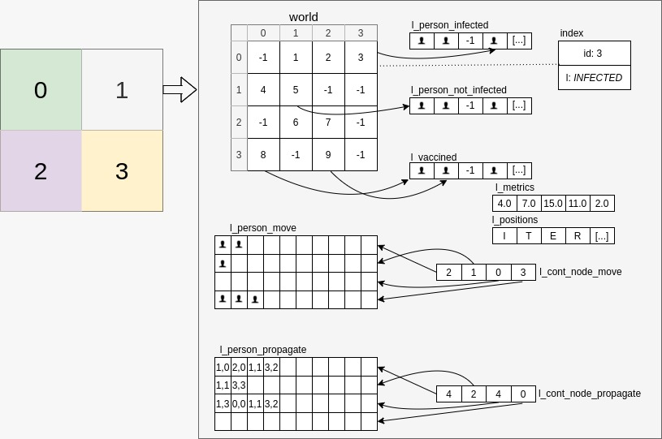

<div id="top"></div>

<br />
<div align="center">

  <h1 align="center">Covid propagation simulator </h1>

  <p align="center">
    MPI paralell Covid propagation
    <br />
    <!--<br />
    <br />
    <a href="https://github.com/othneildrew/Best-README-Template">View Demo</a>
    ·
    <a href="https://github.com/othneildrew/Best-README-Template/issues">Report Bug</a>
    ·
    <a href="https://github.com/othneildrew/Best-README-Template/issues">Request Feature</a>
  </p>
  <h3 align="left">Connect with me:</h3>
    <p align="left">
    <a href="https://www.linkedin.com/in/iakigarcia" target="blank"></a>
    <a href="https://es.stackoverflow.com/users/158274/iakigarci" target="blank"></a>
    </p>-->
</div>


<!-- TABLE OF CONTENTS -->
<details>
  <summary>Table of Contents</summary>
  <ol>
    <li>
      <a href="#about-the-project">About The Project</a>
      <ul>
        <li><a href="#built-with">Built With</a></li>
      </ul>
    </li>
    <li>
      <a href="#getting-started">Getting Started</a>
      <ul>
        <li><a href="#prerequisites">Prerequisites</a></li>
        <li><a href="#installation">Installation</a></li>
      </ul>
    </li>
    <li><a href="#usage">Usage</a></li>
    <li><a href="#contributing">Contributing</a></li>
    <li><a href="#license">License</a></li>
    <li><a href="#contact">Contact</a></li>
  </ol>
</details>


<!-- ABOUT THE PROJECT -->
## About The Project

<p align="center">
    
</p>
The main objective of this project is to simulate the spread of Covid in civilization. The computation of the simulation has been carried out in parallel, using the MPI library of C.

The following components have been taken into account to perform the simulation:

- Person
- Population
- Scenario

In the specified scenario, each person can perform the following actions: move, vaccinate and propagate. The simulation results are stored in a _.out_ file. Here is a summary of the simulation execution:

- Initialize the variables required for MPI.
- If it is Node 0, the different program configuration methods are checked, and the global variables of the simulation configuration are initialized.
- Initialize the global variables.
- The _gsl_ library is initialized, for the probabilities calculation.
- In the case of Node 0, the quadrants, the people to be vaccinated and the population per node are calculated. Once calculated, each variable is sent with an _MPI_Bcast_.
- Initialize the lists dynamically.
- Each node creates its population, with the previously calculated parameters (population per node, quadrants...).
- Iterate with a loop up to the stipulated number of iterations. For each iteration, all the actions that people can do are carried out.
- Each node sends its metrics and positions to Node 0.
- Node 0 prints the metrics and positions in its corresponding file.
- All the structures that remain to be freed are released.
- The simulation is finished.

<p align="right">(<a href="#top">back to top</a>)</p>


### Built With

The technologies used for this project are as follows:
<p align="left">
<!-- https://devicon.dev/ -->
  
<!-- AWS -->
<!-- BASH -->     
<!-- DOCKER -->
<!-- KUBERNETS  -->
<!-- JAVA -->
<!-- JS -->
<!-- Node -->
<!-- EX -->
<!-- TS -->
<!-- React -->
<!-- Mongo -->
<!-- PYTHON -->

<!--  -->
<!--  -->
<!--  -->
<!--  -->
</p>      

<p align="right">(<a href="#top">back to top</a>)</p>


<!-- GETTING STARTED -->
## Getting Started

### Prerequisites

Is mandatory to have installed C program an the _make_ package. To avoid errors during runtime, use Linux instead Windows. The following examples are for an Ubuntu distribution:
* c
  ```sh
  sudo apt install GCC
  ```
### Installation

1. Clone the repo
   ```sh
   git clone https://github.com/iakigarci/KernelSimulator.git
   ```
2. Install C packages
   ```sh
   sudo apt install make gsl
   ```
3. Compile source files
   ```sh
   make
   ```
4. Run the init script. Change the parameters name with the simulation parameters
   ```sh
   ./run.sh metrics.txt [parameters]
   ```
   For example:
   ```sh
   ./run.sh "covid.out -s8 -p0.2 -g60 -b2 -i10 -d2 -m20" 4 
   ```
   With configuration file:
   ```sh
   ./run.sh ”covid.out config_file.txt” 4 
   ```
The parameters that the program accepts are the following. it can also be executed using a _.txt_ configuration file 
- **-s or -world size:** Side of the square matrix. Default value 8.
- **-p or -percent:** Percentage of the population to be vaccinated per iteration. Default value 0.05.
- **-g or -population size:** Population size. Default value 60.
- **-b or -batch:** Number of iterations per batch. Default value 2.
- **-i or -iter:** Number of iterations. Default value 10000.
- **-d or -seed:** N ́umero que act ́ua como semilla. Default value 3.
- **-m or -ageMean:** Average age of the population. Default value 28.

<p align="right">(<a href="#top">back to top</a>)</p>


<!-- USAGE EXAMPLES -->
## Usage

_For more examples, please refer to the [Documentation](CovidMPIDocumentation.pdf) (Spanish)_

<p align="right">(<a href="#top">back to top</a>)</p>


<!-- ROADMAP -->
<!--## Roadmap

- [x] Add Changelog
- [x] Add back to top links
- [ ] Add Additional Templates w/ Examples
- [ ] Add "components" document to easily copy & paste sections of the readme
- [ ] Multi-language Support
    - [ ] Chinese
    - [ ] Spanish

See the [open issues](https://github.com/othneildrew/Best-README-Template/issues) for a full list of proposed features (and known issues).

<p align="right">(<a href="#top">back to top</a>)</p>-->


<!-- CONTRIBUTING -->
## Contributing

Contributions are what make the open source community such an amazing place to learn, inspire, and create. Any contributions you make are **greatly appreciated**.

If you have a suggestion that would make this better, please fork the repo and create a pull request. You can also simply open an issue with the tag "enhancement".
Don't forget to give the project a star! Thanks again!

1. Fork the Project
2. Create your Feature Branch (`git checkout -b feature/AmazingFeature`)
3. Commit your Changes (`git commit -m 'Add some AmazingFeature'`)
4. Push to the Branch (`git push origin feature/AmazingFeature`)
5. Open a Pull Request

<p align="right">(<a href="#top">back to top</a>)</p>


<!-- LICENSE -->
## License

Distributed under the MIT License. See `LICENSE.txt` for more information.

<p align="right">(<a href="#top">back to top</a>)</p>


<!-- CONTACT -->
## Contact

Iñaki García : i.garcia.noya@gmail.com
Asier Zubia: azubia022@gmail.com
Project Link: [https://github.com/Asierzubia/CovidMPI](https://github.com/Asierzubia/CovidMPI)

<p align="right">(<a href="#top">back to top</a>)</p>

<!-- CONTRIBUTORS -->

## Contributors
* iakigarci [https://github.com/iakigarci/](https://github.com/iakigarci/)

* Asierzubia [https://github.com/Asierzubia/](https://github.com/Asierzubia/)


<!-- MARKDOWN LINKS & IMAGES -->
<!-- https://www.markdownguide.org/basic-syntax/#reference-style-links -->
[contributors-shield]: https://img.shields.io/github/contributors/othneildrew/Best-README-Template.svg?style=for-the-badge
[contributors-url]: https://github.com/othneildrew/Best-README-Template/graphs/contributors
[forks-shield]: https://img.shields.io/github/forks/othneildrew/Best-README-Template.svg?style=for-the-badge
[forks-url]: https://github.com/othneildrew/Best-README-Template/network/members
[stars-shield]: https://img.shields.io/github/stars/othneildrew/Best-README-Template.svg?style=for-the-badge
[stars-url]: https://github.com/othneildrew/Best-README-Template/stargazers
[issues-shield]: https://img.shields.io/github/issues/othneildrew/Best-README-Template.svg?style=for-the-badge
[issues-url]: https://github.com/othneildrew/Best-README-Template/issues
[license-shield]: https://img.shields.io/github/license/othneildrew/Best-README-Template.svg?style=for-the-badge
[license-url]: https://github.com/othneildrew/Best-README-Template/blob/master/LICENSE.txt
[linkedin-shield]: https://img.shields.io/badge/-LinkedIn-black.svg?style=for-the-badge&logo=linkedin&colorB=555
[linkedin-url]: https://linkedin.com/in/othneildrew
[product-screenshot]: images/screenshot.png
